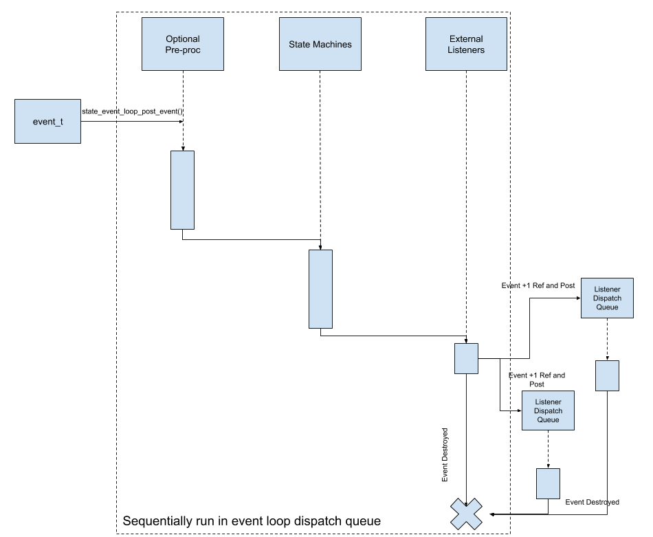

# State Event Loop

The state event loop consolidates a set of state machines, a notifier and a dispatch queue to create an abstraction for an event loop. 
An event posted to the state_event_loop is processed in the following order within the state event loop's dispatch queue:
1. An optional pre-processor callback will first process the event. This callback can only be implemented by the implementer of the state_event_loop and 
   is not intended to be used by external clients.
2. Each state machine will sequentially process the event with each state machine processing and transitioning before the 
   next state machine processes the event.
3. The event will be dispatched to external listener dispatch queues (after incrementing the reference count on the event) and destroyed
   after being processed.
4. The event is destroyed.

## Usage
Assume we have an application with the following event types and event data structure.
```
tyepdef enum {
  EventA,
  EventB,
  EventC,
  EventMax
}event_e;

typedef struct {
  event_e id;
  union {
    struct {
      uint32_t data1;
    }event_a_data;
    struct {
      uint32_t data2;
    }event_b_data;
    struct {
      uint32_t data3;
    }event_c_data;
  }data;
}sel_event_t;
```
The loop also has __two state machines__ one representing power states and the other representing camera modes. Assume all the state code exists in the appropriate locations. Lets also assume that the state event loop can __queue upto 32 events__ and be able to register __60 callbacks__. We also want the state event loop to have a dispatch queue of __stack size 8KB__. The event loop would like to allow external listeners to listen for events using the following callback signature
```
typedef void event_proc_f(sel_event_t* event, void* private_data);
```
The implementer will have to implement notification block 
```
typedef struct {
  notifier_block_t base;
  event_proc_f fn;
  void* private_data;
}sel_notification_block_t;
```
and provide a notifier delegate callback of the form
```
typedef void (*notifier_f) (notifier_block_t * p_block, uint32_t category, void *p_notification_data);
```
Assume one exists in 
```
static void sel_notifier_f(notifier_block_t * p_block, uint32_t category, void *p_notification_data);
```
Refer to the [Notifier documentation](notifier.md).

### Creating the state event loop
As with the other utilities, here too we will create the storage required statically using helper macros. 

```
typedef struct {
  ...
  state_event_loop_t * p_loop;
}sel_state_data_t;
```
#### [Declaring the storage type](../inc/cutils/state_event_loop.h#L131)
In global scope
```
STATE_EVENT_LOOP_STORE_DECL(someMacroIdentifier, 2, 32, 60, EventMax, 8*1024, sizeof(sel_notification_block_t), sizeof(sel_event_t));
```
#### [Defining an instance of the storage type](../inc/cutils/state_event_loop.h#L141)
In global scope
```
STATE_EVENT_LOOP_STORE_DEF(someMacroIdentifier);
```
#### [Creating a state event loop](../inc/cutils/state_event_loop.h#L147)
In the initialization code of the loop implementation
```
void sel_implementation_init(void)
{
  ...
  state_event_loop_create_params_t create_params;
  STATE_EVENT_LOOP_CREATE_PARAMS_INIT(create_params, 
                                      someMacroIdentifier, 
                                      "MyAppLoop", 
                                      CUTILS_TASK_PRIORITY_MEDIUM,
                                      sel_notifier_f,
                                      array_of_state_machine_names_for_debug,
                                      array_of_starting_state_id,
                                      s_sel_state_data);
  s_sel_state_data.p_loop = state_event_loop_init(&create_params);
  CUTILS_ASSERT(s_sel_state_data.p_loop);
  
  //Add all the states per state machine using state_event_loop_add_state()
  //Add an optional pre-processor callback defined in this compilation unit using state_event_loop_install_event_pre_proc()
  //Start the state event loop
}
```

When the state event loop start, the first states will be entered in each of the state machines, and the starting states corresponding `init()` and `enter()` functions will be called. From this point on events generated by the system will be processed. 
External modules can install and remove listeners using
```
state_event_loop_register_notification()
state_event_loop_deregister_notification()
```

More usage details can be found in the [unit test](../tests/state_event_loop_tests.c) and in the inline comments in the [header file](../inc/cutils/state_event_loop.h)

## Event Processing Diagram

